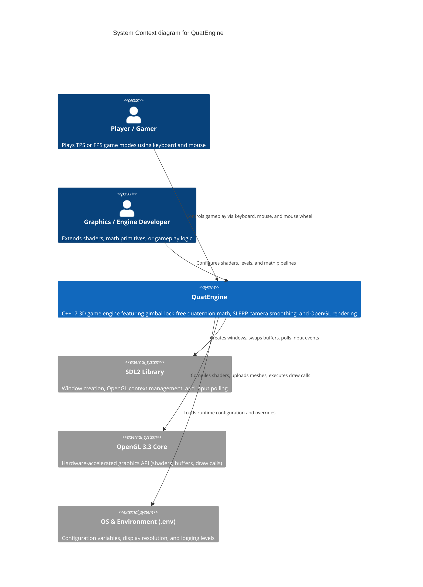

# Architecture Map: QuatEngine

Visual and structured map of the system architecture for `QuatEngine`,
aligned with the C4 model standard and the maintainable architecture contract.

## 1. System Context (C4Context)

High-level diagram showing users, game engine subsystems, and external library dependencies.



---

## 2. Container Diagram (C4Container)

Container-level view showing internal engine modules, core subsystems, and rendering pipeline.

```mermaid
C4Container
    title Container diagram for QuatEngine

    Person(user, "Player / Caller", "Interacts via executable or tests")

    Container_Boundary(c1, "QuatEngine Subsystems")
        Container(main_app, "Composition Root", "main.cpp & src/demo/*", "Entrypoint, application bootstrap, game loop, and system coordination")
        Container(math_lib, "Math Core", "src/math/*", "Quaternion algebra, Vec3, Mat4, SLERP/NLERP interpolation, and coordinate transformations")
        Container(core_subsys, "Core Utilities & Config", "src/core/*", "Transform hierarchy, ConfigManager, Logger, Metrics, and Readiness probes")
        Container(renderer, "Renderer & Shaders", "src/renderer/* & shaders/*", "OpenGL loader, Mesh primitives, OBJParser, Camera, and Shader programs")
        Container(input_subsys, "Input Manager", "src/input/*", "SDL2 key and mouse event processing")
        Container(game_subsys, "Game Systems (TPS / FPS)", "src/game/*", "Controllers, Combat, AI, LevelLoader, and Wave state machines")
    Container_Boundary_End()

    System_Ext(sdl2_api, "SDL2 API", "Platform event loop and windowing")
    System_Ext(gl_driver, "OpenGL Driver", "GPU execution pipeline")

    Rel(user, main_app, "Runs qe_demo executable")
    Rel(main_app, core_subsys, "Initializes engine config and readiness probes")
    Rel(main_app, input_subsys, "Processes frame input events")
    Rel(input_subsys, sdl2_api, "Polls SDL_Event queue")
    Rel(main_app, game_subsys, "Updates controllers, combat, and enemy AI")
    Rel(game_subsys, math_lib, "Uses Quaternion rotations and SLERP camera interpolation")
    Rel(main_app, renderer, "Draws meshes and activates shaders")
    Rel(renderer, math_lib, "Computes view/projection matrices via Mat4 and Camera")
    Rel(renderer, gl_driver, "Issues OpenGL draw commands")
```

---

## Feature Map

| Capability | Component | Interface | Evidence |
| --- | --- | --- | --- |
| Quaternion Algebra & SLERP | Math Core | `src/math/Quaternion.h` | `tests/test_quaternion_algebra.cpp` |
| Vector & Matrix Operations | Math Core | `src/math/Vec3.h`, `Mat4.h` | `tests/test_math.cpp` |
| Runtime Config & Dotenv Overrides | Core Utilities | `src/core/ConfigManager.h`, `EngineConfig.h` | `tests/test_config.cpp` |
| Observability Metrics & Health Probes | Core Utilities | `src/core/Metrics.h`, `Readiness.h` | `tests/test_metrics.cpp`, `test_readiness.cpp` |
| Wave Progression & Enemy AI | Game Systems | `src/game/tps/WaveSystem.h`, `AI.h` | `tests/test_wave.cpp`, `test_tps_ai.cpp` |
| TPS Weapons & Combat Mechanics | Game Systems | `src/game/tps/Combat.h`, `TPSWeapons.h` | `tests/test_tps_weapons.cpp`, `test_tps_combat.cpp` |
| OBJ Model Parsing & Upload | Renderer | `src/renderer/OBJParser.h`, `OBJLoader.h` | `tests/test_objloader.cpp` |
| Camera & Gimbal-Lock-Free View | Renderer | `src/renderer/Camera.h` | `tests/test_behavior.cpp` |
| Layered Architecture & Invariants | System Invariants | `tests/test_architecture_dbc.py` | `tests/test_architecture_dbc.py` |
| Architecture Map Contract Validation | Architecture Validator | `scripts/architecture_map_contract.py` | `tests/test_architecture_map_contract.py` |

---

## Architecture Change Log

| Date | Issue / PR | Description |
| --- | --- | --- |
| 2026-09-10 | #1611 | Initial C4 architecture map specification (Context, Container, Feature Map, Change Log) per Epic #1594 |
